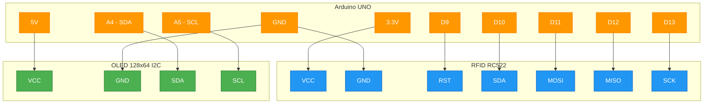
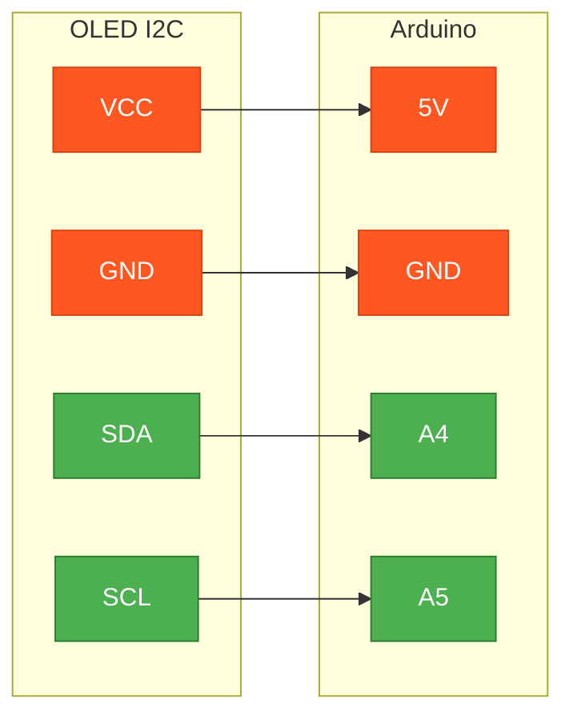
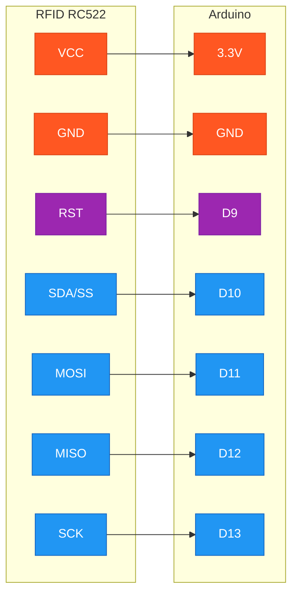
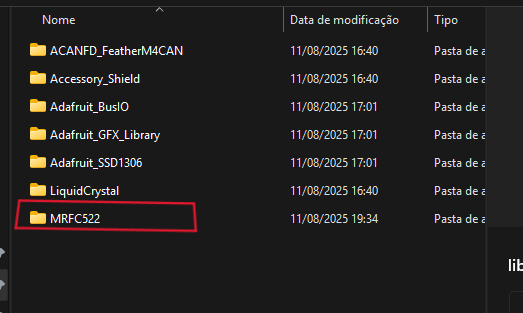

# Projeto Arduino RFID + OLED

Este projeto usa um módulo RFID RC522 e um display OLED I2C para verificar tags RFID e mostrar no display se o acesso foi autorizado ou negado.

# 🔧 Projeto RFID + OLED Display

## 📦 Componentes Necessários

- 🔌 Arduino UNO/Nano
- 📡 Módulo RFID RC522
- 📺 Display OLED 128x64 I2C
- 🔗 Jumpers macho-fêmea

---

## 🔌 Diagrama de Conexões

---

## 📺 Display OLED 128x64 I2C

### 📋 Tabela de Conexões - OLED

| Pino OLED | Arduino UNO | Função | Status |
|-----------|-------------|---------|---------|
| VCC | 5V | Alimentação | ✅ Conectado |
| GND | GND | Terra | ✅ Conectado |
| SDA | A4 | Dados I2C | ✅ Conectado |
| SCL | A5 | Clock I2C | ✅ Conectado |

### 🔄 Diagrama OLED I2C

---

## 📡 Módulo RFID RC522

### 📋 Tabela de Conexões - RFID

| Pino RFID | Arduino UNO | Protocolo | Função | Status |
|-----------|-------------|-----------|---------|---------|
| VCC | 3.3V | Alimentação | Tensão | ✅ Conectado |
| GND | GND | Alimentação | Terra | ✅ Conectado |
| RST | D9 | Digital | Reset | ✅ Conectado |
| SDA | D10 | SPI | Chip Select | ✅ Conectado |
| MOSI | D11 | SPI | Master Out Slave In | ✅ Conectado |
| MISO | D12 | SPI | Master In Slave Out | ✅ Conectado |
| SCK | D13 | SPI | Serial Clock | ✅ Conectado |

### 🔄 Diagrama RFID SPI

---

## ⚡ Resumo das Conexões por Protocolo

### 🔌 Alimentação
| Tensão | Destino | Pinos |
|--------|---------|--------|
| **5V** | OLED Display | VCC |
| **3.3V** | RFID RC522 | VCC |
| **GND** | Ambos | GND |

### 📶 Protocolos de Comunicação

#### I2C (OLED)
| Função | Arduino | OLED |
|--------|---------|------|
| **SDA** | A4 | SDA |
| **SCL** | A5 | SCL |

#### SPI (RFID)
| Função | Arduino | RFID | Descrição |
|--------|---------|------|-----------|
| **SS** | D10 | SDA | Chip Select |
| **MOSI** | D11 | MOSI | Master → Slave |
| **MISO** | D12 | MISO | Slave → Master |
| **SCK** | D13 | SCK | Clock |
| **RST** | D9 | RST | Reset |

---

## ⚠️ Observações Importantes

> **💡 Tensão de Alimentação:**
> - OLED: 5V (compatível com lógica 5V)
> - RFID: 3.3V (importante para não danificar o módulo)

> **🔧 Protocolos:**
> - OLED usa comunicação I2C (2 fios)
> - RFID usa comunicação SPI (4 fios + reset)

> **📱 Endereço I2C padrão do OLED:** 0x3C ou 0x3D

## Código
O código está no arquivo `src/main.ino`.

## Bibliotecas Necessárias

Para rodar este projeto, você precisa instalar algumas bibliotecas no Arduino IDE:

- **Adafruit_SSD1306**
- **Adafruit_GFX**
- **MFRC522**

---

### Instalação da biblioteca MFRC522

A biblioteca MFRC522 **não está disponível diretamente no gerenciador de bibliotecas do Arduino**. Para instalá-la, siga estes passos:

1. Baixe o arquivo ZIP da biblioteca no repositório oficial no GitHub:  
   [https://github.com/miguelbalboa/rfid](https://github.com/miguelbalboa/rfid)

2. Extraia o conteúdo do arquivo ZIP.

3. Renomeie a pasta extraída para `MFRC522` (caso não esteja com este nome).

4. Imagem de Exemplo da pasta com o nome renomeado
   

5. Copie essa pasta para a pasta de bibliotecas do Arduino:
    - No Windows, geralmente fica em:  
      `Documents/Arduino/libraries/`
    - No Linux/macOS, em:  
      `~/Arduino/libraries/`

6. Reinicie o Arduino IDE para que a biblioteca seja reconhecida.

---

### Outras bibliotecas usadas no projeto

As bibliotecas **Adafruit_SSD1306** e **Adafruit_GFX** podem ser instaladas diretamente pelo Gerenciador de Bibliotecas do Arduino IDE.

---

Pronto! Com isso, seu projeto poderá compilar e rodar corretamente.
